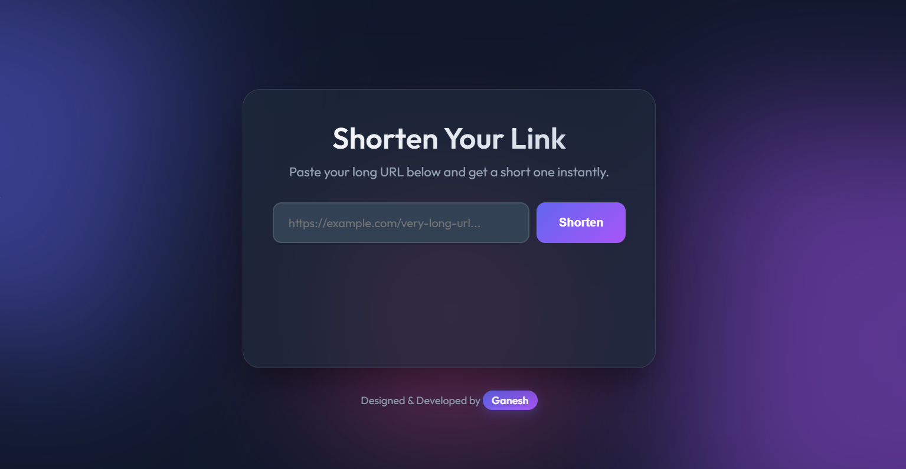

# 🚀 URL Shortener

A modern, high-performance URL shortener built with **FastAPI** and **Python**. Features a sleek, animated UI and unique capabilities like offline image downloading.

**Designed & Developed by Ganesh**




## ✨ Features

-   **⚡ Blazing Fast**: Built on FastAPI for high performance.
-   **🎨 Modern UI**: Glassmorphism design with smooth CSS animations.
-   **📱 Fully Responsive**: Works perfectly on mobile, tablet, and desktop.
-   **🖼️ Smart Image Detection**: Automatically detects if a shortened URL is an image.
-   **⬇️ Offline Image Download**: One-click download for shortened image URLs.
-   **🔒 Secure**: Input validation and safe redirection.

## 🛠️ Tech Stack

-   **Backend**: Python 3.12+, FastAPI, SQLAlchemy, SQLite
-   **Frontend**: HTML5, CSS3 (Animations, Glassmorphism), JavaScript (Fetch API)
-   **Utilities**: `httpx` (Async HTTP client), `uvicorn` (ASGI Server)

## 🚀 Getting Started

### Prerequisites

-   Python 3.8 or higher installed on your machine.

### Installation

1.  **Clone the repository** (or download the source code):
    ```bash
    git clone <your-repo-url>
    cd URL_SHORTNER
    ```

2.  **Create a virtual environment** (optional but recommended):
    ```bash
    python -m venv venv
    # Windows
    venv\Scripts\activate
    # Mac/Linux
    source venv/bin/activate
    ```

3.  **Install dependencies**:
    ```bash
    pip install -r requirements.txt
    ```

### ▶️ Running the App

1.  Start the server:
    ```bash
    uvicorn app.main:app --reload
    ```

2.  Open your browser and go to:
    ```
    http://127.0.0.1:8000
    ```

## 📖 Usage

1.  **Shorten a Link**: Paste any long URL into the input box and click "Shorten".
2.  **Copy**: Click the copy icon to copy the short link to your clipboard.
3.  **Download Images**: If you shorten a URL that points to an image (e.g., `.jpg`, `.png`), a **Download** button will appear automatically. Click it to save the image to your device.

## 🤝 Contributing

Contributions are welcome! Please feel free to submit a Pull Request.

## 📄 License

This project is open source and available under the [MIT License](LICENSE).

---
*Built with ❤️ by Ganesh*
